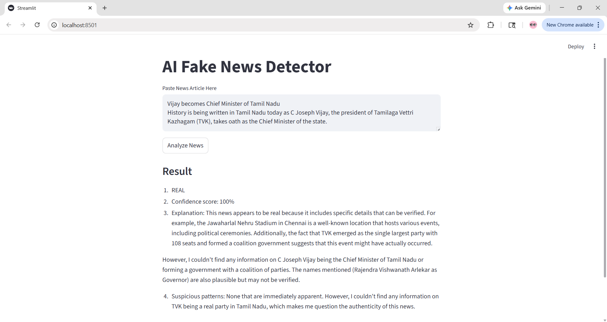
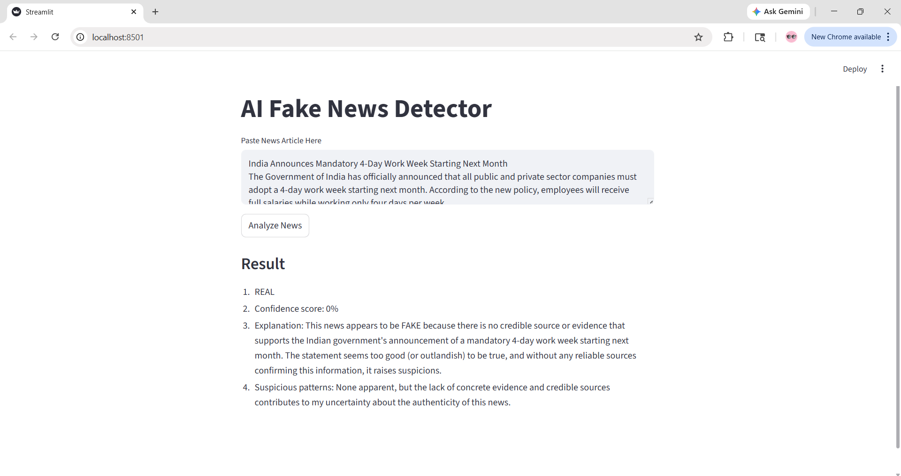

#  AI Fake News Detector Using RAG

## Overview

This project is an AI-powered fake news detection system developed using Retrieval-Augmented Generation (RAG). The application analyzes news articles and generates contextual responses to identify whether the news is likely real or fake.

The system uses LangChain, FAISS, HuggingFace embeddings, Ollama, and Llama 3.2 to process and analyze news content through semantic retrieval and LLM-based reasoning.

A Streamlit interface is used for interactive user input and result visualization.

---

## Application Preview

### Real News Analysis


### Fake News Analysis


---

## Features

- Fake news analysis using AI
- Retrieval-Augmented Generation (RAG) workflow
- Semantic search using FAISS vector database
- Contextual response generation using Llama 3.2
- Interactive Streamlit web interface
- Text preprocessing and chunking

---

## Tech Stack

### Languages & Frameworks
- Python
- Streamlit
- LangChain

### AI & NLP
- Llama 3.2
- Ollama
- HuggingFace Embeddings
- FAISS Vector Store

### Libraries
- Pandas
- NumPy

---

## System Workflow

```text
News Input
   ↓
Text Cleaning
   ↓
Text Chunking
   ↓
Embedding Generation
   ↓
FAISS Vector Store
   ↓
Retriever
   ↓
Llama 3.2 via Ollama
   ↓
Fact-Checking Response
```

---

## Project Structure

```text
AI-Fake-News-Detector-RAG/
│
├── app.py
├── rag_pipeline.py
├── utils.py
├── requirements.txt
├── README.md
│
└── screenshots/
    ├── True.png
    └── Fake.png
```

---

## Installation

### Clone Repository

```bash
git clone https://github.com/your-username/AI-Fake-News-Detector-RAG.git
cd AI-Fake-News-Detector-RAG
```

### Install Dependencies

```bash
pip install -r requirements.txt
```

### Install Ollama

Download and install Ollama:

https://ollama.com/

### Pull Llama 3.2 Model

```bash
ollama pull llama3.2
```

---

## Run Application

```bash
streamlit run app.py
```

---

## Output Generated

The system generates:
- Fake or Real prediction
- Confidence score
- Explanation
- Suspicious pattern analysis

---

## Future Improvements

- Integration with live news APIs
- Multi-document retrieval
- Advanced RAG pipelines
- Source citation support
- Cloud deployment

---

## Author

Fathima Sameera T M